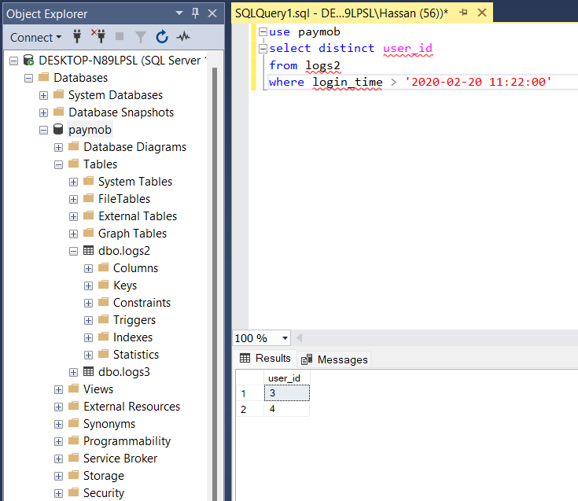

# SQL Task


```sql
use paymob

select distinct user_id
from   logs2
where  login_time > '2020-02-20 11:22:00'
```

`Steps:`

**1. Created Paymob Databse**

**2. Created tables and filled it with data for testing**

# 

